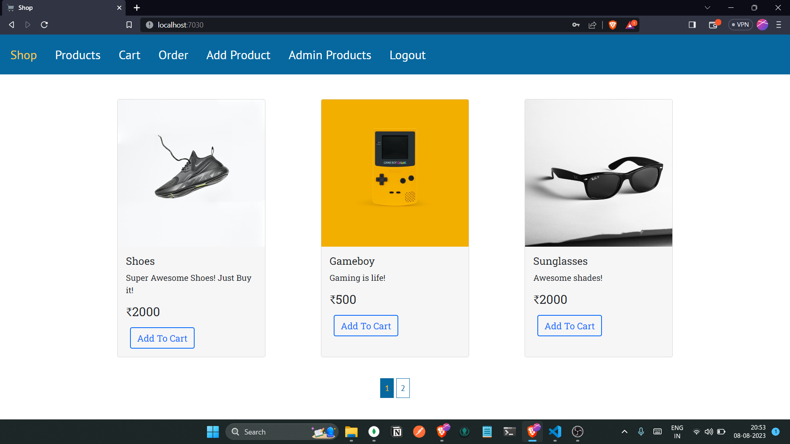

# Manjrekar Shop

Welcome to the Manjrekar Shop Web App! This is a full-stack web application built on MongoDB, Express, and Node.js for the backend, and Bootstrap and EJS for the frontend. The app is a centralized market place platform for users to buy or sell product with amazing shopping experience. Users can register, reset their password, receive confirmation emails, manage their products, ensure security with CSRF tokens, integrate Stripe payments, and even download on-the-fly generated invoices.

## Features

- **User Registration**: Users can sign up for an account to access the shop's features.

- **Password Reset**: Users have the option to reset their password if they forget it.

- **Confirmation Emails**: Upon registration, login or password reset, users receive confirmation emails.

- **Product Management**: Users can create, update, and delete their products.

- **CSRF Tokens**: The app is secured with Cross-Site Request Forgery (CSRF) tokens to prevent unauthorized actions.

- **Stripe Integration**: Stripe is integrated for secure and seamless payment processing.

- **Invoice Generation**: The app generates invoices on the fly for users to download after making purchases.

## Installation

1. Clone the repository: `git clone https://github.com/VighneshManjrekar/manjrekar-shop`
2. Navigate to the project directory: `cd manjrekar-shop`
3. Install backend dependencies: `npm install`
4. Set up environment variables:
   - Rename a `.env.env` file to `.env`.
5. Start the project: for development mode `npm run dev` for production mode `npm start`.

## Usage

- Access the application at `http://localhost:7030` in your web browser.
- Register for an account or log in if you already have one.
- Explore the shop, add products to your cart, and proceed to checkout.
- Use Stripe for secure payment processing.
- Download invoices for your purchases.

## Technologies Used

### Backend

- MongoDB
- Express
- Node.js

### Frontend

- Bootstrap
- EJS

## Structure

The project structure follows MVC architecture:

- `Model`: Contains the database schema.
- `View`: Holds the client-side code, EJS templates.
- `Controller`: Includes logic to perform all the tasks.

## Demo

Click on the image to watch the demo video or click the [Live link](https://manjrekar-shop.glitch.me/) to try it out yourself.
